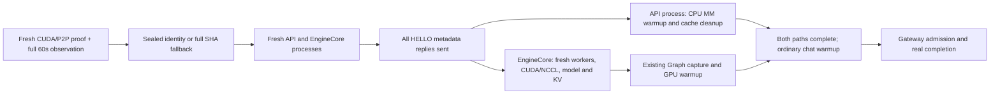

# Recovery optimization

MEASURED/HISTORICAL: accepted recovery v1 completed in203.288s, including109.010s supervisor→ready. This receipt is preserved separately; it is not the contemporaneous A/B baseline. New optimization measurements and final production fault are in [results](evidence/recovery/RECOVERY-OPTIMIZATION-RESULTS.json).

## Attribution and decision

MEASURED: the startup observer found about16s API renderer warmup,11–13s repeated model SHA, blocked fresh-spawn pipe writes about7.9s each, nested EngineCore initialization about55s, and graph capture about1.8s. Safetensors iteration was about2.9s. The123.259s instrumented reload and old109.010s are different launches: no quantified observer-overhead claim. Nested spans, ranks and peer waits cannot be summed into an exclusive total. Detailed stage coverage, CPU/RSS/I/O/NVML/PCIe samples, cache records and missing hooks are in [breakdown](evidence/recovery/RECOVERY-RELOAD-BREAKDOWN.json) and [cache inventory](evidence/recovery/RECOVERY-CACHE-INVENTORY.json).

DERIVED/SOURCE: worker spawn payloads119743–120764bytes exceeded a65536-byte pipe; pickle serialization was about1ms but pipe writes waited for child imports. This explains much of the apparent distributed-init peer wait; PyNccl communicator construction itself was about0.44s. No global spawn/pipe patch or fork of CUDA was adopted.

The first accepted candidate moves the existing multimodal CPU renderer warmup to after every EngineCore HELLO metadata reply and before waiting for READY. The API thread runs it synchronously while the independent fresh EngineCore initializes. Admission still waits for both. Cache clearing, thread restoration, chat warmup, repeated explicit warmup and failure propagation remain. The rejectedv43 callback preceded HELLO replies and would serialize work; it was never GPU activated. Current DP1/internal-engine and MM configuration were qualified. This is not proof that every future multimodal connector/IPC configuration is CPU-only.

The second candidate replaces repeated model SHA in the critical path with a sealed fast identity check. Offline sealing reads and verifies every original inventory file through an O_NOFOLLOW file descriptor and checks identity before/after hashing and again by pathname. Reload compares device/inode/size/mtime_ns/ctime_ns and the inventory, model revision, image, profile/environment, driver/kernel/P2P/GPU inputs. Any mismatch invokes the unchanged original full verifier; invalid full SHA remains fatal. The launcher verifies both helper and receipt as sealed release files before use. There is no automatic reseal. This assumes trusted immutable local model/release storage, not an adversary able to rewrite the trusted release or mutate files after validation; it does not eliminate all TOCTOU from the underlying loader.

MEASURED cache limit: all1095seeded Triton files retained identical hashes;8new files belonged to one rejection_greedy_sample_kernel specialization and appeared after model readiness. Their artifact-write timestamps are not a compiler-duration measurement. No zero-JIT or universal cache-hit claim is made. Additional cache blessing was not mixed into the two-variable recovery experiment.

Both optimizations occur after the hardware gate. No preparer was launched during hardware observation. All replacements use fresh containers, processes, CUDA contexts and communicators. Ownership, first-failure, pidfd signaling,15s cleanup grace,8s forensics, CUDA/P2P probe and the full60s hardware observation remain. Graph strategy C retains FULL_DECODE_ONLY capture4; eager-first/lazy/background capture was rejected because measured capture cost was small and unqualified concurrent paths add risk. Weight/H2D parallelism, persistent loaders, precreated containers and worker-only restart were not justified by measured benefit.

## Startup ordering

The engine and API are separate fresh processes. No new background thread or GPU context survives the failed instance. The diagram is ordering, not a sum of measured durations.

## Measurement and qualification

A3 then B3 then C3, fresh replacement for every fault; single variable A->B and B->C. Fixed polling phase, exact pidfd worker loss during real 67584-token prefill, matching compatible compile caches. Block order disclosed; descriptive n=3, no statistical population guarantee. No startup observer on measured runtime. Root agent performed light file/document work; no concurrent GPU workload or benchmark.

MEASURED (seconds; median [min, max]):

| Release | Full completion | Reload | Old supervisor gone → new supervisor |
|---|---:|---:|---:|
| A_fallback | 206.562 [205.786, 211.325] | 112.554 [112.327, 115.774] | 66.758 [65.691, 67.960] |
| B_renderer | 192.144 [190.969, 192.466] | 97.661 [96.676, 99.073] | 66.814 [65.767, 66.986] |
| C_renderer_inventory | 179.818 [176.572, 180.886] | 85.561 [85.441, 86.630] | 66.790 [63.531, 66.929] |

DERIVED: reductions are from matched-current repeated baselines, not subtraction from the older single 203.288s receipt. Historical v1 remains intact.

- Formal latencies use existing fault harness wall timestamps; stage observer spans use monotonic timestamps. Wall-clock discontinuities were not independently instrumented in that harness; cross-clock incident conversion is separately documented.
- Model throughput requests here are correctness checks, not a new matched throughput qualification.
- Selected raw logits and token hashes are exact; no full-vocabulary logit equivalence claim.
- Safety includes fresh CUDA/P2P proof, full 60-second hardware observation and replacement observation. No replacement-model GPU work starts before gate; the recovery-only probe is itself part of that gate.

CPU regression covers handshake ordering and error paths, repeated multimodal warmup/cache cleanup, stale/changed files and inputs, same-size/mtime tampering, replacement/link/missing-file cases and unchanged full-SHA fallback behavior. Real1K/16K/66K/258K completions compare exact output hashes and selected raw logits; Vision/Tools and state are checked separately. Nine repeated faults use real66K in-flight requests and exact pidfd worker ownership. Each requires fresh hardware proof, complete admission and another60s replacement observation. Per-trial native weight/graph/ready events and inventory fast-path records are in [native timelines](evidence/recovery/RECOVERY-NATIVE-FAULT-TIMELINES.json).

The immutable production copy, rollback to the accepted fallback, final fault, live source/installed/process identity and independent review have their own receipts. CURRENT-PRODUCTION.json and the final report determine promotion status; a candidate PASS alone does not mean production promotion. Historical v1 and the new repeated v2 measurements are both retained in PERFORMANCE-BASELINES.json.

## Qwen4 relevance

Transfer the measured-stage method, sealed-identity/full-SHA fallback principle, safe handshake ordering, fresh-process ownership and rollback gates. Re-derive renderer APIs, connector behavior, config structure, inventory coverage, graph shapes and CPU/GPU boundaries from Qwen4 source. Do not copy these four vLLM files or the model stat receipt into a new architecture without qualification. Rebuild identity receipts and caches for changed model/runtime/driver inputs.
